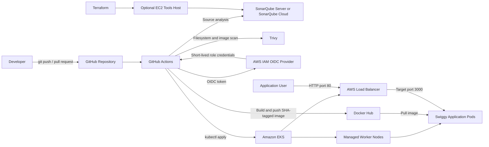

# Secure DevSecOps CI/CD Pipeline (GitHub Actions) for the Swiggy Clone on Amazon EKS

---

## Project Summary

This repository contains the infrastructure configurations, security pipelines, and deployment manifests required to automatically provision, audit, and deploy a containerized Swiggy application clone into Amazon Elastic Kubernetes Service (EKS) via a secure, passwordless GitHub Actions workflow.

## Architecture Delivery Flow Overview



### <u> Infrastructure Provisioning</u>

***```Terraform```*** deploys an AWS EC2 Management instance.

### <u>  Cluster Creation</u>

- eksctl configures a production-ready ***```Amazon EKS cluster```***  with managed Node Groups.

### <u>  Identity Federation</u>

- ***```OpenID Connect - OIDC```*** establishes short-lived cryptographic trust between ***```GitHub Actions```*** and ***```AWS IAM```***.

### <u>  CI/CD Quality Gates</u>

- Code pushes trigger ***```SonarQube```*** quality analysis and  ***```Aqua Security Trivy```*** vulnerability checks.

### <u>  Continuous Deployment</u>

- Successfully scanned container images are pushed to ***```Docker Hub```*** and automatically applied via ***Kubernetes manifests*** to EKS, spawning high-availability pods behind an automated ***```AWS Elastic Load Balancer```***.

---

## Repository Structure

Organize the repository as follows:

```text
swiggy-clone-app/
├── .github/
│   └── workflows/
│       └── build.yml
├── infrastructure/
│   ├── install.sh
│   ├── main.tf
│   ├── outputs.tf
│   ├── provider.tf
│   ├── terraform.tfvars.example
│   ├── variables.tf
│   └── versions.tf
├── k8s/
│   └── deployment-and-service.yml
├── Dockerfile
├── .dockerignore
├── sonar-project.properties
├── package.json
├── package-lock.json
└── README.md
```

## PHASE 0: DEFINE THE DEPLOYMENT VALUES

Use the following values throughout the runbook. Replace them where required.

| Setting | Example |
| --- | --- |
| AWS Region | `us-east-1` |
| EKS Cluster | `swiggy-clone-app` |
| Kubernetes Namespace | `swiggy` |
| GitHub Owner | `Your-GitHub-UserName` |
| GitHub Repository | `swiggy-clone-app` |
| IAM Deployment Role | `GitHubActions-EKS-Deploy-Role` |
| Docker Hub Repository | `ursulan1/swiggy-clone-app` |
| SonarQube Project Key | `swiggy-clone-app` |
| Application Port | `3000` |
| Public Service Port | `80` |

---

## PHASE 1: PROVISION THE MANAGEMENT ENVIRONMENT (TERRAFORM)

### STEP 1: Define the Configuration Files

1. **provider.tf**

```hcl
terraform {
  required_providers {
    aws = {
      source  = "hashicorp/aws"
      version = "~> 6.20.0" # Using '~>' is a best practice to allow minor patch updates
    }
  }
}

provider "aws" {
  region = "us-east-1"
}
```

2. **main.tf**

```hcl
resource "aws_instance" "web" {
  ami                    = "ami-0287a05f0ef0e9d9a"
  instance_type          = "t3.medium"
  key_name               = "newkey" # Removed '.pem' extension
  vpc_security_group_ids = [aws_security_group.github_action_vm_sg.id]
  user_data              = templatefile("./install.sh", {})

  tags = {
    Name = "GitHubAction-SonarQube"
  }

  root_block_device {
    volume_size = 40
  }
}

resource "aws_security_group" "github_action_vm_sg" {
  name        = "GitHubAction-VM-SG"
  description = "Allow TLS inbound traffic"

  # Idiomatic Terraform way to loop over ports
  dynamic "ingress" {
    for_each = [22, 80, 443, 8080, 9000, 3000]
    content {
      description = "Inbound traffic for port ${ingress.value}"
      from_port   = ingress.value
      to_port     = ingress.value
      protocol    = "tcp"
      cidr_blocks = ["0.0.0.0/0"]
    }
  }

  egress {
    from_port   = 0
    to_port     = 0
    protocol    = "-1"
    cidr_blocks = ["0.0.0.0/0"]
  }

  tags = {
    Name = "GitHubAction-VM-SG"
  }
}
```

3. **install.sh:**

```bash
#!/bin/bash
sudo apt update
sudo apt install fontconfig openjdk-21-jre -y
java -version         
```

### STEP 2: Deploy the Infrastructure

Initialize and apply the Terraform configuration state:

```bash
terraform init
terraform plan
terraform apply --auto-approve
```

## PHASE 2: MANAGEMENT SERVER CONFIGURATION & LOCAL TOOLING

Log into the newly created EC2 Instance via SSH to set up Docker, SonarQube, Trivy, and EKS CLI utilities.

### STEP 1: Connect and Clone Application Context

```bash
# Clone directly on the remote host
git clone https://github.com/UrsulaN1/swiggy-clone-app.git
cd swiggy-clone-app
```

- OR from your Windows terminal, copy project folder from your local machine to your EC2 instance:

```bash
scp -i "\path\to\newkey.pem" -r "\path\to\local\code-folder" ubuntu@<EC2_PUBLIC_IP>:/home/$USER
```

### STEP 2: Install Docker Engine

```bash
sudo apt-get update
sudo apt-get install docker.io -y
sudo usermod -aG docker $USER
newgrp docker
```

### STEP 3: Deploy Security Engines (SonarQube & Trivy)

```bash
# Run SonarQube community image
docker run -d --name sonar -p 9000:9000 sonarqube:lts-community

# Install Aqua Security Trivy via APT repository
sudo apt-get install wget apt-transport-https gnupg lsb-release -y
wget -qO- https://aquasecurity.github.io/trivy-repo/deb/public.key | gpg --dearmor | sudo tee /usr/share/keyrings/trivy.gpg > /dev/null
echo "deb [signed-by=/usr/share/keyrings/trivy.gpg] https://aquasecurity.github.io/trivy-repo/deb $(lsb_release -sc) main" | sudo tee /etc/apt/sources.list.d/trivy.list
sudo apt-get update
sudo apt-get install trivy -y
```

**SonarQube Web Access:**

[http://publicIP:9000] (by default username & password is admin)

Trivy Image Scan Test Command

```bash
trivy image <imageid>
```

## PHASE 3: IDENTITY FEDERATION & COMPONENT SECURITY INTEGRATION

Configure tokens, security trust stores, and credential structures across SonarQube, Docker Hub, AWS IAM, and your GitHub repository context.

### STEP 1. Generate External Tooling Access Vectors

**This allows SonarQube to automatically scan your code on every pull request or commit, and push the results (like code smells, bugs, and coverage) right back into your GitHub UI.**

#### <u> I. Create a GitHub Token in SonarQube</u>

SonarQube needs permission to comment on your pull requests and update commit statuses in GitHub.

- Log into your SonarQube dashboard
- Click your user profile icon (top right) and go to My Account > Security.
- Under Generate Tokens:Name it something like ***swiggy-cone-app***.
- Select User Token or Global Analysis Token. Click Generate and copy the token.
- You will need this in the next step.

#### <u> II - Generate the PAT in Docker Hub</u>

- Log into your Docker Hub account.
- Click on your profile avatar in the top-right corner and select Account Settings.
- On the left sidebar, click Generate ne token.
- Give your token a description (e.g., swiggy-clone-app) and leave the access permissions as Read & Write (since your pipeline needs to push images).
- Click Generate.

CRITICAL: Copy the generated token immediately. You will not be able to see it again once you close the window.

#### <u> III - Add SonarQube and Docker Hub Secrets to GitHub</u>

To keep your SonarQube and Docker Hub credentials secure, save them as Secrets inside your GitHub repository.

- Go to your GitHub repository.
- Click on Settings > Secrets and variables > Actions.
- Click **New repository secret** and add the following two secrets:

| Secret Name | Value |
| :--- | :--- |
| **SONAR_TOKEN** | Past the generatedSonarqube token |
| **SONAR_HOST_URL** | The full URL of your SonarQube server (e.g., `http://123.45.67.89:9000`) |
| **DOCKER_USERNAME** | Past your Docker Hub username |
| **DOCKER_PASSWORD** | Paste the PAT token you copied from Docker Hub |
| **AWS_ACCESS_KEY_ID** | Paste your AWS Access Key for your IAM user |
| **AWS_SECRET_ACCESS_KEY** | Paste your AWS Secret Access Key for your IAM user |
| **AWS_ACCOUNT_ID** | Paste your 12-digit ID |

### OR Use **OIDC** instead of AWS Credetials

This completely removes the need to store long-lived AWS_ACCESS_KEY_ID and AWS_SECRET_ACCESS_KEY strings in GitHub, substituting them with dynamic, short-lived tokens valid for only a single pipeline run.

#### OIDC 1: Add GitHub as an Identity Provider in AWS

**First, you need to tell your AWS account to trust security tokens handed out by GitHub.**

- Open the AWS IAM Console.
- On the left navigation pane, select Identity Providers, then click Add Provider.
- Configure these exact settings:
  - Provider Type: OpenID Connect
  - Provider URL: [https://token.actions.githubusercontent.com]
  - Audience: sts.amazonaws.com
- Click Add Provider.

#### OIDC 2: Create the IAM Role for GitHub Actions

**Now you need to create an IAM role that your pipeline can assume.**
This role must be explicitly scoped down so only your specific GitHub repository can use it.

**In the IAM Console, navigate to Roles -> Create Role.**

- Select Custom trust policy and paste the JSON configuration below.
- Make sure to replace <YOUR_AWS_ACCOUNT_ID>, <YOUR_GITHUB_USERNAME>, and <YOUR_REPO_NAME> with your exact details:

```json
{
    "Version": "2012-10-17",
    "Statement": [
        {
            "Effect": "Allow",
            "Principal": {
                "Federated": "arn:aws:iam::<YOUR_AWS_ACCOUNT_ID>:oidc-provider/token.actions.githubusercontent.com"
            },
            "Action": "sts:AssumeRoleWithWebIdentity",
            "Condition": {
                "StringEquals": {
                    "token.actions.githubusercontent.com:aud": "sts.amazonaws.com"
                },
                "StringLike": {
                    "token.actions.githubusercontent.com:sub": "repo:<YOUR_GITHUB_USERNAME>/<YOUR_REPO_NAME>:*"
                }
            }
        }
    ]
}
```

- Attach the following inline policy to the IAM role you just created:

```json
{
    "Version": "2012-10-17",
    "Statement": [
        {
            "Effect": "Allow",
            "Action": [
                "eks:DescribeCluster",
                "eks:ListClusters"
            ],
            "Resource": "arn:aws:eks:us-east-1:123456789012:cluster/swiggy-clone-app"
        }
    ]
}
```

#### <u> IV. Create a SonarQube Project</u>

- In SonarQube, click Create Project (usually in the top right of the homepage).
- Choose Manually (or select GitHub if you are using SonarQube Cloud/Enterprise with the official GitHub App integration).
- Give your project a Project key and Display name (e.g., swiggy-clone-app). Keep track of this key!
- Set the main branch (e.g., main or master).

## PHASE 4: CREATE EKS CLUSTER

### STEP 1: install kubectl on EC2

```bash
sudo apt install -y curl
curl -LO "https://dl.k8s.io/release/$(curl -L -s https://dl.k8s.io/release/stable.txt)/bin/linux/amd64/kubectl"
sudo install -o root -g root -m 0755 kubectl /usr/local/bin/kubectl
kubectl version --client
```

### STEP 2: Install AWS CLI and Clone Repo

```bash
# Download and install AWS CLI v2
curl "https://awscli.amazonaws.com/awscli-exe-linux-x86_64.zip" -o "awscliv2.zip"
sudo apt install -y unzip
unzip awscliv2.zip
sudo ./aws/install
aws --version

# Configure global git parameters and clone repository
git config --global user.name "Your.Name"
git config --global user.email "your.email@gmail.com"
```

### STEP 3: Install  eksctl

```bash
curl --silent --location "https://github.com/weaveworks/eksctl/releases/latest/download/eksctl_$(uname -s)_amd64.tar.gz" | tar xz -C /tmp
cd /tmp
sudo mv /tmp/eksctl /bin
eksctl version
```

### STEP 4: Create IAM Role for EKS

- Craete a Role with AWS Service as trusted entity
- Select EC2 from the dropdown (or common use cases), then click Next
- Add permissions: In the search box, type ***AdministratorAccess***. Check the box next to it in the list. Click Next.
- Name and review: Name the role something easy to remember, like ***EC2-Admin-Role-For-EKS***.
- Attach the IAM Role to your EC2 instance

Give about 10 seconds for AWS to propagate the permissions, then verify it works by checking your identity:un the following command:

```bash
aws sts get-caller-identity
```

### STEP 5: Setup Kubernetes Cluster using eksctl

Run the cluster creation command. Note: This process typically takes 15 to 20 minutes to complete.

```bash
eksctl create cluster --name swiggy-clone-app \
    --region us-east-1 \
    --node-type t2.medium \
    --nodes 2
```

### STEP 6: Map GitHub OIDC Role to Kubernetes RBAC

#### 1. Register your GitHub role with the EKS cluster

(replace 123456789012 with your actual 12-digit AWS account number)

```bash
aws eks create-access-entry \
    --cluster-name swiggy-clone-app \
    --principal-arn arn:aws:iam::123456789012:role/GitHubActions-EKS-Deploy-Role \
    --region us-east-1
```

#### 2. Grant that entry full Cluster Admin permissions

```bash
aws eks associate-access-policy \
    --cluster-name swiggy-clone-app \
    --principal-arn arn:aws:iam::123456789012:role/GitHubActions-EKS-Deploy-Role \
    --policy-arn arn:aws:eks::aws:cluster-access-policy/AmazonEKSClusterAdminPolicy \
    --access-scope type=cluster \
    --region us-east-1
```

### STEP 7: Verify Cluster Configuration

```bash
# Update local kubeconfig context to check access
aws eks update-kubeconfig --region us-east-1 --name swiggy-clone-app

# Verify control plane and node accessibility
kubectl get nodes
kubectl get all
```

## PHASE 5: PIPELINE & RUNTIME DEPLOYMENT MANIFESTS

Commit these files to your application source tree repository root to manage declarative workload states.

### STEP 1: Add the Deployment & Service Manifest File

```deployment-and-service.yml```

```YAML
apiVersion: apps/v1
kind: Deployment
metadata:
  name: swiggy-clone-app
  labels:
    app: swiggy-clone-app
spec:
  replicas: 2
  selector:
    matchLabels:
      app: swiggy-clone-app
  template:
    metadata:
      labels:
        app: swiggy-clone-app
    spec:
      terminationGracePeriodSeconds: 30
      containers:
      - name: swiggy-clone-app
        image: ursulan1/swiggy:latest
        imagePullPolicy: "Always"
        ports:
        - containerPort: 3000
---
apiVersion: v1
kind: Service
metadata:
  name: swiggy-clone-app
  labels:
    app: swiggy-clone-app
spec:
  type: LoadBalancer
  ports:
  - port: 80
    targetPort: 3000
  selector:
    app: swiggy-clone-app
```

### STEP 2: Add the CI/CD Pipeline Configuration File

```.github/workflows/build.yml```

```YAML
name: Build and Deploy Swiggy Clone App

on:
  push:
    branches:
      - main
    paths-ignore:
      - '**.md' # Avoid triggering deployment loops on doc changes

jobs:
  build:
    name: Build and Deploy
    runs-on: ubuntu-latest
    
    permissions:
      id-token: write   
      contents: read    

    steps:
      - name: Checkout Code
        uses: actions/checkout@v4
        with:
          fetch-depth: 0  

      - name: SonarQube Scan
        uses: sonarsource/sonarqube-scan-action@v3
        env:
          SONAR_TOKEN: ${{ secrets.SONAR_TOKEN }}
          SONAR_HOST_URL: ${{ secrets.SONAR_HOST_URL }}

      - name: Aqua Security Scan (Trivy)
        uses: aquasecurity/trivy-action@master
        with:
          scan-type: 'fs'

      - name: Login to Docker Hub
        uses: docker/login-action@v3
        with:
          username: ${{ secrets.DOCKER_USERNAME }}
          password: ${{ secrets.DOCKER_PASSWORD }}

      - name: Build and push Docker images
        uses: docker/build-push-action@v6.18.0
        with:
          context: .
          push: true
          tags: ursulan1/swiggy:latest

      - name: AWS Login via OIDC
        uses: aws-actions/configure-aws-credentials@v4
        with:
          role-to-assume: arn:aws:iam::${{ secrets.AWS_ACCOUNT_ID }}:role/GitHubActions-EKS-Deploy-Role
          aws-region: us-east-1

      - name: Get EKS Credentials
        run: |
          aws eks update-kubeconfig --region us-east-1 --name swiggy-clone-app

      - name: Set up kubectl
        uses: azure/setup-kubectl@v4
        with:
          version: 'latest'

      - name: Deploy to EKS
        run: |
          kubectl apply -f deployment-and-service.yml
```

### STEP 3: Push Changes to Trigger Pipeline

```bash
git init
git config --global user.name "Your Name"
git config --global user.email "your.email@example.com"
git add .
git commit -m "feat: complete automated EKS OIDC delivery workflow"
git remote add origin https://github.com/UrsulaN1/swiggy-clone-app.git
git branch -M main
git push -u origin main
```

```markdown
> **Pro-Tip:** To push code documentation updates without triggering your automated workflows, append `[skip ci]` to your git commit message.
```

## PHASE 6: APPLICATION ROUTING VALIDATION

### What happens when you apply this manifest

#### <u> 1. Deployment Creates Pods</u>

It will spin up 2 replicas (Pods) running your Docker image ursulan1/swiggy. Inside those pods, your ***Node.js application*** is listening on port ***3000***.

#### <u> 2. Service Provisions an AWS Load Balancer</u>

Since the service type is set to LoadBalancer, AWS EKS will talk directly to your AWS account and provision a physical Classic Load Balancer (ELB) or Network Load Balancer (NLB) automatically.

#### <u> 3. Traffic Routing</u>

The AWS Load Balancer will listen for public traffic on standard web port 80 and forward it internally to your application pods on port 3000.

### How to access your application once deployed

After your GitHub Actions pipeline successfully runs
```kubectl apply -f deployment-and-service.yml```, run this command below on your EC2 instance (or wait for the pipeline to finish) to get your public app URL:

```Bash
kubectl get svc swiggy-clone-app
```

Look at the ```EXTERNAL-IP``` column in the output. It will contain a long AWS domain name that looks something like this:
```a73xxxxxxxxx-123456789.us-east-1.elb.amazonaws.com```

Copy that URL, paste it into your web browser, and your live Swiggy Clone application should load up instantly!

(Note: It can take 2–3 minutes for the AWS Load Balancer to finish provisioning and pass its health checks once the URL appears).

## CLEANUP AND RESOURCE TEARDOWN

To completely avoid unnecessary cloud provider costs, delete all provisioned components in the exact chronological sequence outlined below.

### STEP 1: Delete Kubernetes Ingress Resources

Before destroying the cluster, cleanly remove the deployed application and services.

```bash
# View all active deployments and services
kubectl get all

# Delete the application deployment and service
# Note: Ensure the name matches what is defined in your deployment-and-service.yml
kubectl delete deployment swiggy-clone-app
kubectl delete service swiggy-clone-app
```

### STEP 2: Delete the EKS Cluster

Teardown the entire infrastructure built by eksctl. This will delete the CloudFormation stacks, worker nodes, and the control plane. (This process takes about 15 minutes).

```bash
eksctl delete cluster --name swiggy-clone-app --region us-east-1
```

### STEP 3: Clean Up Local Docker Containers (EC2/Local Runner)

```bash
# List all containers (running and stopped)
docker ps -a

# Stop and remove specific containers (replace 'xxx' with Container ID or Name)
docker stop xxx
docker rm xxx

# Optional: Fast way to purge all unused containers, networks, and images
docker system prune -a --volumes -f
```

### STEP 4: Destroy Terraform Resources

If you spun up any underlying infrastructure components (like management VMs or databases) using Terraform, destroy them last.

```Bash
terraform destroy --auto-approve
```
